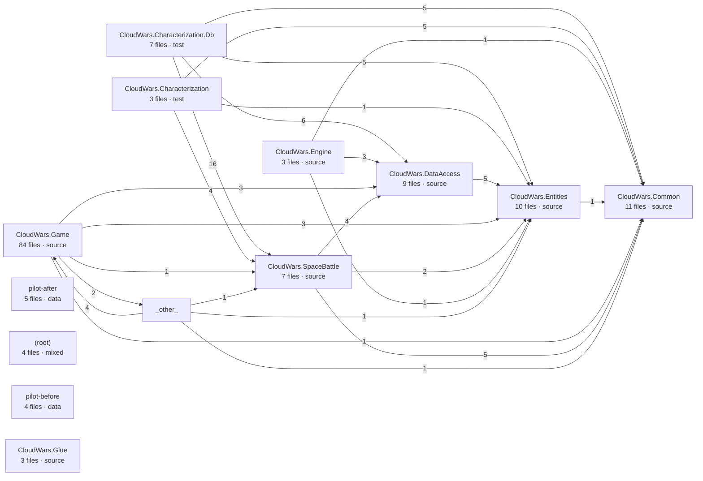

# Architecture map — cloudwarsgame

Generated 2026-09-21T20:43:29.276Z · 150 files indexed · 500 file-level relationships

Profile: {"rootPath":"C:\\src\\cloudwarsgame","projectType":"existing","isGreenfield":false,"detectedLanguages":[{"name":"C#","confidence":0.95,"evidence":["Found 68 .cs files","Found CloudWars.Characterization.Db/CloudWars.Characterization.Db.csproj","Found CloudWars.Characterization/CloudWars.Characterization.csproj","Found CloudWars.Common/CloudWars.Common.csproj","Found CloudWars.sln"]},{"name":"JavaScript","confidence":0.72,"evidence":["Found 40 .js files"]}],"detectedTools":[{"name":".NET","category":"runtime","confidence":0.95,"evidence":["Found CloudWars.Characterization.Db/CloudWars.Characterization.Db.csproj","Found CloudWars.Characterization/CloudWars.Characterization.csproj","Found CloudWars.Common/CloudWars.Common.csproj","Found CloudWars.DataAccess/CloudWars.DataAccess.csproj"]},{"name":".NET test","category":"test","confidence":0.85,"evidence":["Found common .NET test package in .csproj"]}],"importantFiles":[{"path":"CloudWars.Characterization.Db/CloudWars.Characterization.Db.csproj","reason":"C# project file."},{"path":"CloudWars.Characterization/CloudWars.Characterization.csproj","reason":"C# project file."},{"path":"CloudWars.Common/CloudWars.Common.csproj","reason":"C# project file."},{"path":"CloudWars.DataAccess/CloudWars.DataAccess.csproj","reason":"C# project file."},{"path":"CloudWars.Engine/CloudWars.Engine.csproj","reason":"C# project file."},{"path":"CloudWars.Entities/CloudWars.Entities.csproj","reason":"C# project file."},{"path":"CloudWars.Game/CloudWars.Game.csproj","reason":"C# project file."},{"path":"CloudWars.Glue/CloudWars.Glue.csproj","reason":"C# project file."},{"path":"CloudWars.SpaceBattle/CloudWars.SpaceBattle.csproj","reason":"C# project file."},{"path":"CloudWars.sln","reason":"C# solution file."}],"suggestedValidationCommands":["dotnet build","dotnet test"],"summary":"Detected an existing project using C#, JavaScript; tools include .NET, .NET test.","notes":["This appears to be an existing project.","Follow existing project structure, languages, tools, dependencies, and patterns.","Do not introduce new dependencies unless clearly needed.","Use suggested validation commands when appropriate: dotnet build, dotnet test."]}

## Modules

| Module | Path | Role | Files | Summary |
|---|---|---|---|---|
| **CloudWars.Game** | `CloudWars.Game` | source | 84 | CloudWars.Game contains 84 source files in C#, CSS, HTML, JavaScript, Markdown, XML. |
| **CloudWars.Common** | `CloudWars.Common` | source | 11 | CloudWars.Common contains 11 source files in C#, XML. |
| **CloudWars.Entities** | `CloudWars.Entities` | source | 10 | CloudWars.Entities contains 10 source files in C#, XML. |
| **CloudWars.DataAccess** | `CloudWars.DataAccess` | source | 9 | CloudWars.DataAccess contains 9 source files in C#, XML. |
| **CloudWars.Characterization.Db** | `CloudWars.Characterization.Db` | test | 7 | CloudWars.Characterization.Db contains 7 test files in C#, XML. |
| **CloudWars.SpaceBattle** | `CloudWars.SpaceBattle` | source | 7 | CloudWars.SpaceBattle contains 7 source files in C#, XML. |
| **pilot-after** | `pilot-after` | data | 5 | pilot-after contains 5 data files in JSON. |
| **(root)** | `(root)` | mixed | 4 | (root) contains 4 mixed files in C#, Markdown, XML. |
| **pilot-before** | `pilot-before` | data | 4 | pilot-before contains 4 data files in JSON. |
| **CloudWars.Characterization** | `CloudWars.Characterization` | test | 3 | CloudWars.Characterization contains 3 test files in C#, XML. |
| **CloudWars.Engine** | `CloudWars.Engine` | source | 3 | CloudWars.Engine contains 3 source files in C#, XML. |
| **CloudWars.Glue** | `CloudWars.Glue` | source | 3 | CloudWars.Glue contains 3 source files in C#, XML. |

## Module dependency graph

